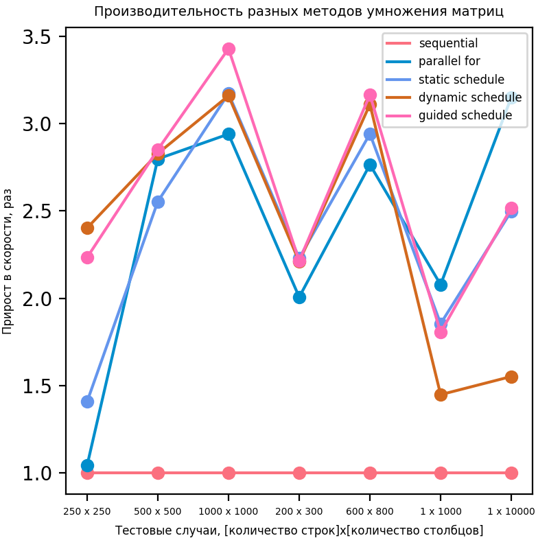
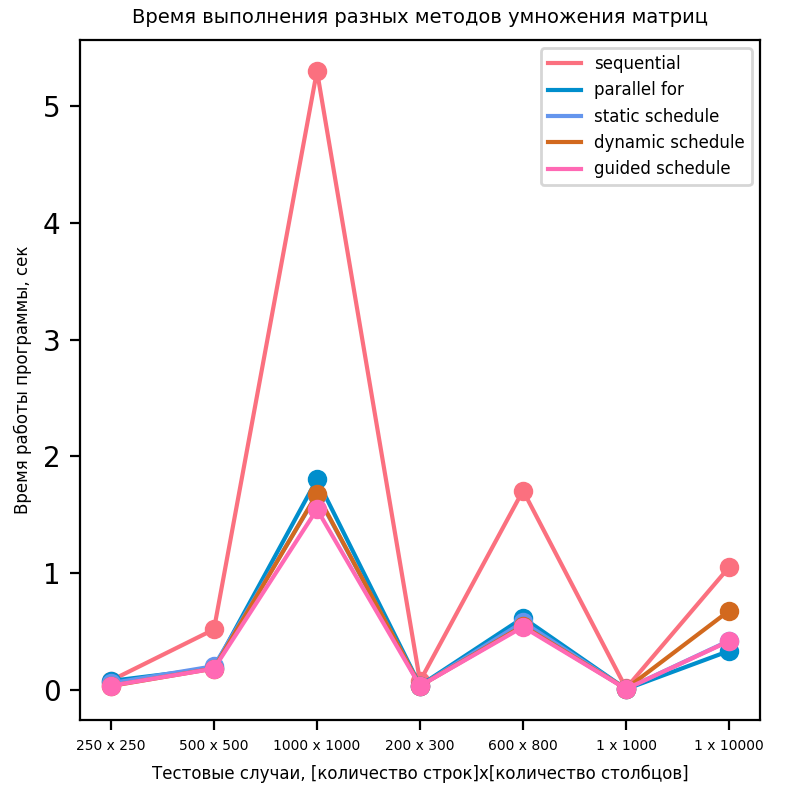

# Результаты 

## Характеристики ПК
- OS: Ubuntu 19.10
- CPU: Intel(R) Core(TM) i5-7400 CPU @3.00GHz; 1 Physical processor; 4 cores; 4 threads
- RAM: 16 GB

## Полученные результаты
Замеры производительности также отражены на графике.

## Выводы
Перемножение матриц с использованием технологии `OpenMP` дало прирост в скорости вычислений более чем в 2.5 раза.

