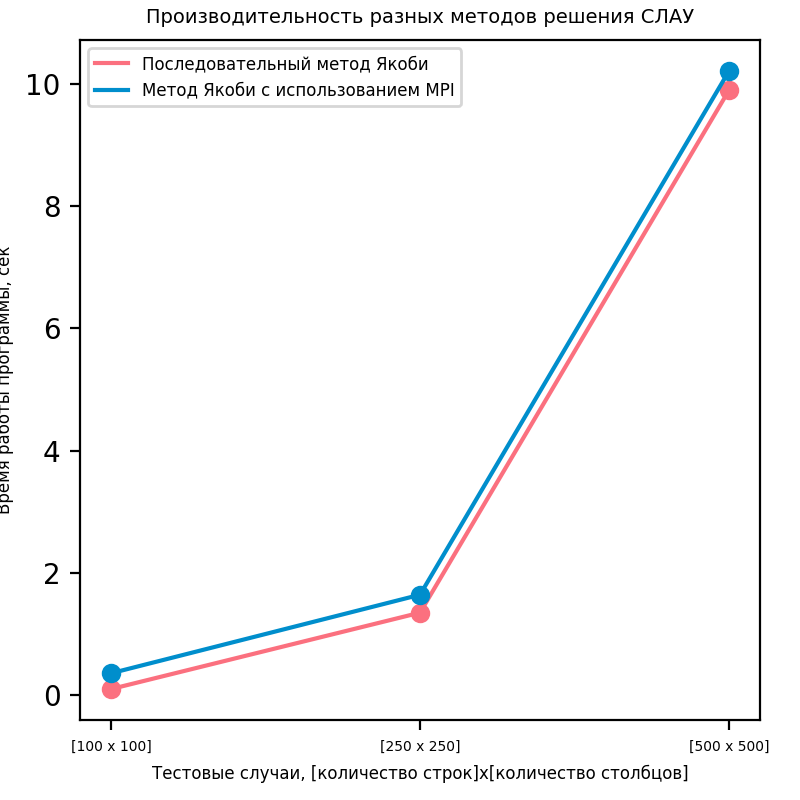

# Результаты 

## Характеристики ПК
- OS: Ubuntu 19.10
- CPU: Intel(R) Xeon(R) CPU E5-2640 v3 @ 2.60GHz; 2 Physical processors; 8 cores per processor; 16 threads per processor;
- RAM: 110 GB

## Полученные результаты
### Test Case 0 [100 x 100] * [100]
- Последовательный метод Якоби: 0.20344161987304688 сек
- Метод Якоби с использованием MPI: 0.1339879035949707 сек
### Test Case 1 [250 x 250] * [250]
- Последовательный метод Якоби: 2.515465021133423 сек
- Метод Якоби с использованием MPI: 1.3880202770233154 сек
### Test Case 2 [500 x 500] * [500]
- Последовательный метод Якоби: 26.38815426826477 сек
- Метод Якоби с использованием MPI: 12.533878564834595 сек

Замеры производительности также отражены на графике.

## Выводы
Перемножение матриц с использованием технологии `MPI` дало прирост в скорости вычислений более чем в 2 раза.

