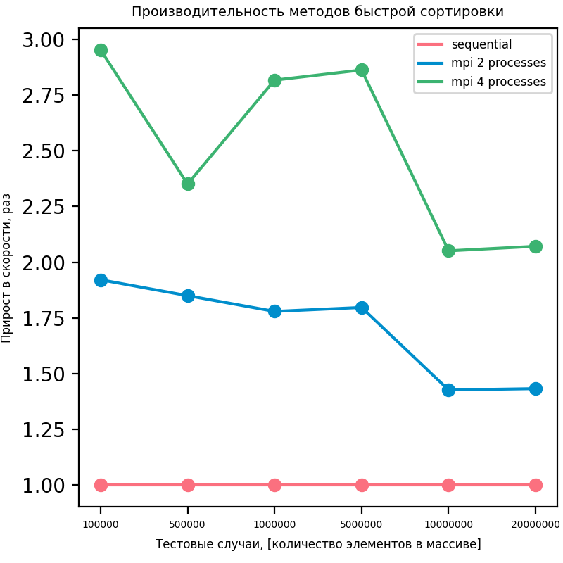
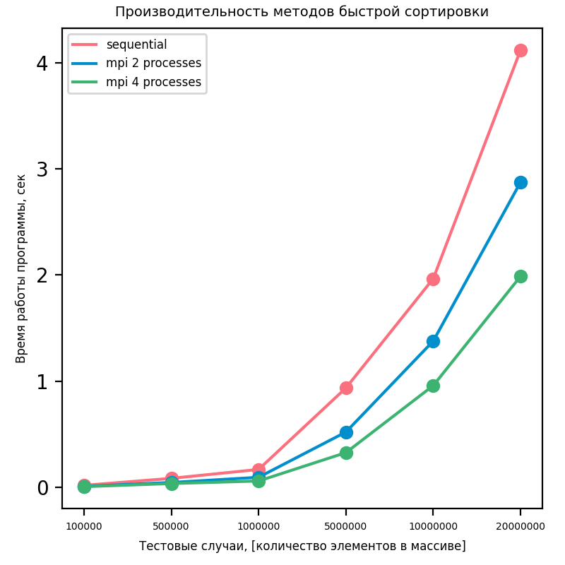

# Лабораторная работа №3. Сортировка массивов

## Требования
Для запуска данной задачи необходимо, чтобы было установлено следующее ПО:
 - компилятор `mpicxx`
 - утилита `make`
 - утилита `cmake`
 - утилита `mpiexec`
 - интерпретатор языка `python` версии 3.6+
 
## Структура папок
- исходники лабораторной работы находятся в папке `./sources`
- скрипт для измерения производительности находится в папке `./scripts`
- описание полученных результатов находится в файле `report.md`
- полная постановка задачи находится в файле `task_description.pdf` 

## Компиляция и запуск
Компиляция и запуск реализованы с помощью Makefile.
Для установки `python`-зависимостей необходимо выполнить
```bash
make install
```
Для компиляции исходного кода программы необходимо выполнить
```bash
make build
```
Для запуска тестов производительности необходимо выполнить
```bash
make run
```

# Описание алгоритма
Для корректной работы алгоритма необходимо количество процессов численно равное степени двойки.

1. Разбиваем данные так, чтобы каждому процессу досталось примерно `n / procs_num` элементов.
2. Далее осуществляем обмен данными по принципу N-мерного гиперкуба.
3. Выбираем опорный элемент. Отправляем этот элемент каждому процессу в группе.
4. В каждом процессе разбиваем данные на 2 части согласно значению опорного элемента: большие и меньшие его.
5. Выполняем объем данными с процессом-партнером, номер которого вычисляется по разнице в N-бите.
    Процесс с меньшим номер отправляет элементы большие опорного партнеру, и ждет элементы меньшие опорного от партнеру
    Процесс с большим номером отправляет элементы меньшие опорного партнеру, и ждет элементы большие опорного от партнера
6. Таким образом все процессы разбиты на 2 группы: те которые содержат элементы меньшие опорного, и те которые содержат большие.
7. Далее пункты 2-7 повторяются еще `N - 1`-раз
8. После этого на каждом процессе выполняется последовательная сортировка элементов.
9. Далее эти упорядоченные данные получает процесс с номером 0 и объединяет их в один упорядоченный массив.


# Результаты 

## Характеристики ПК
- OS: Ubuntu 19.10
- CPU: Intel(R) Core(TM) i5-7400 CPU @3.00GHz; 1 Physical processor; 4 cores; 4 threads
- RAM: 16 GB

## Полученные результаты
Замеры производительности также отражены на графике.




Запуск производился 5 раз для каждого набора данных, потом бралось усредненное значение.
Таким образом было получено ускорение в среднем в 1.2-1.3 раза относительно последовательного способа. 