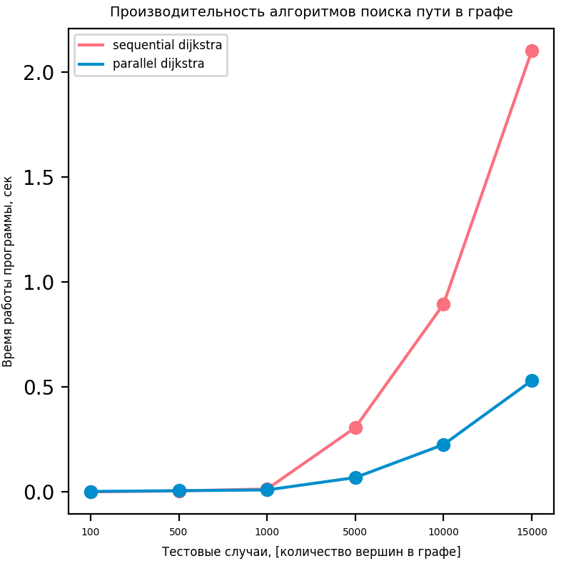

# Лабораторная работа №4. Поиск кратчайшего пути на графе

## Требования
Для запуска данной задачи необходимо, чтобы было установлено следующее ПО:
 - компилятор `g++`
 - утилита `make`
 - утилита `cmake`
 - интерпретатор языка `python` версии 3.8+
 
## Структура папок
- исходники лабораторной работы находятся в папке `./sources`
- скрипт для измерения производительности находится в папке `./scripts`
- описание полученных результатов находится в файле `report.md`
- полная постановка задачи находится в файле `task_description.pdf` 

## Компиляция и запуск
Компиляция и запуск реализованы с помощью Makefile.
Для установки `python`-зависимостей необходимо выполнить
```bash
make install
```
Для компиляции исходного кода программы необходимо выполнить
```bash
make build
```
Для запуска тестов производительности необходимо выполнить
```bash
make run
```
# Результаты 

## Характеристики ПК
- OS: Ubuntu 19.10
- CPU: Intel(R) Core(TM) i5-7400 CPU @3.00GHz; 1 Physical processor; 4 cores; 4 threads
- RAM: 16 GB

## Тестовые данные
Для проверки производительности различных реализаций метода Дейкстры были предложены следующие тестовые данные.
На область с координатами **X in [0 .. 100_000]; Y in [0..100_000]**, случайным образом распределяется N-случайных точек.
Далее с помощью алгоритма k-ближайших сосесей выполняется построение графа, где k = 20. Вес ребер вычисляется по евклидовой метрике.
После этого производится замер времени работы.
## Полученные результаты
Замеры производительности также отражены на графике.




Исходя из представленных выше графиков, было получено существенное ускорение работы программы при количестве вершин в графе более 500.

